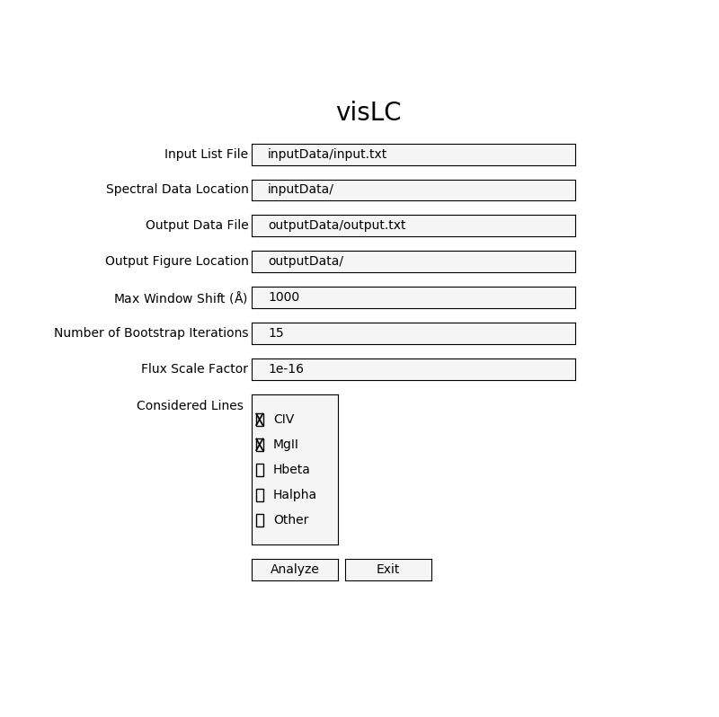
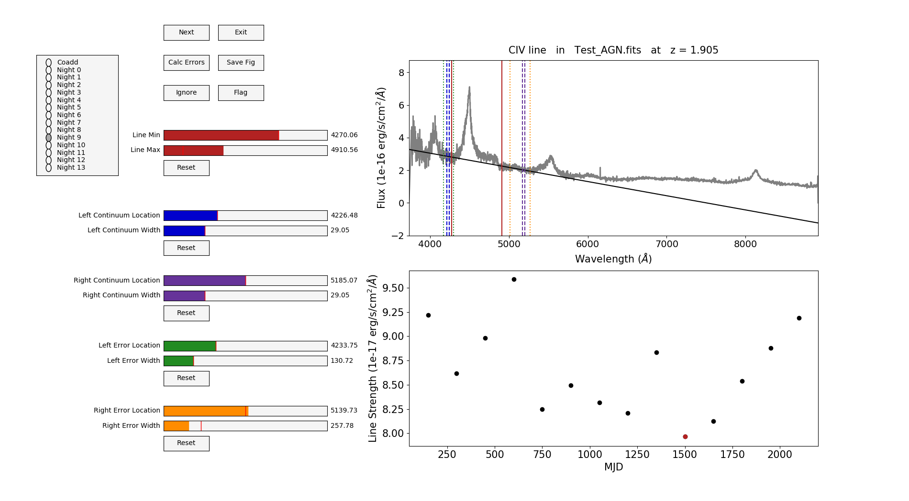
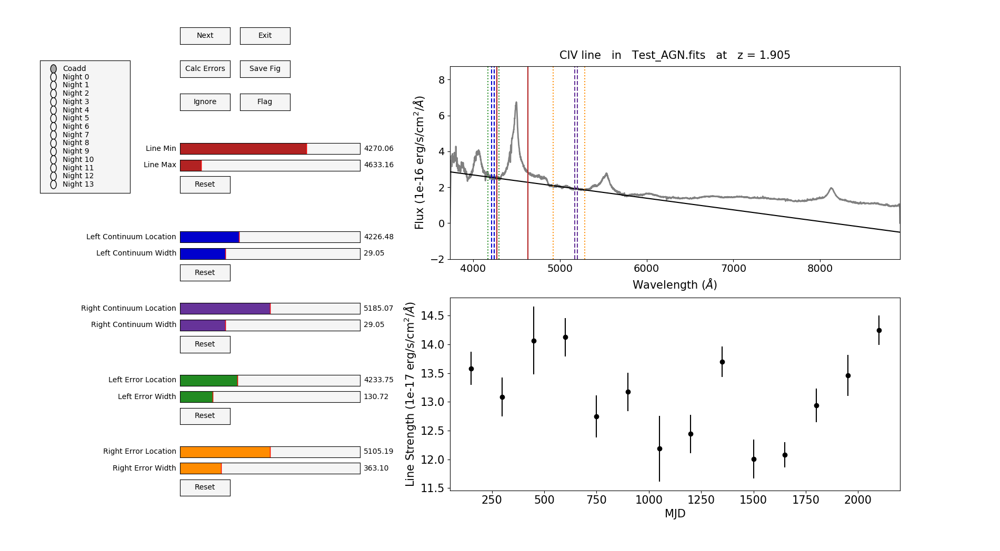

# visLC
This is a widget which allows you to play with the analysis choices made when generating emission line light curves from AGN spectral data to make informed decisions about which parameters to use.  After loading in your spectral data it will call the same functions used in [OzDES_makeLC](https://github.com/jhoormann/OzDES_makeLC) to make the emission light curve.  You can then interactivly play with the line integration windows, local continuum subtraction windows, and continuum uncertainty regions to determine how these choices impact the resulting light curve and uncertainties.  

# Starting visLC
To run execute >> python visCalc.py.  You will then see the following screen where you can specify some initial parameters.

## Input List File
This is the path and name of the file that lists the names of all the spectral data files you want to analyze.  You don't need to include the path to the data just the name of each file (ie Test_AGN.fits).

## Spectral Data Location
This is the path to where you are keeping your data which includes all the data listed in the file specified above.

This program assumes the input spectra are saved in the fits format outputted after calibration and coadding obtained using [OzDES_calibSpec](https://github.com/jhoormann/OzDES_calibSpec).  These fits files are read in using the class defined in SpectralClass.py.  If you data is in a different form all you need to do is modify this class to handle your files.  As long as you don't change the overall class structure the rest of the code should work without issue.

## Output Data File
The chosen windows for each AGN/emission line will be saved to the location/file specified in this field.  The following columns will be appended to the output file.

ID    Line    z    Flag    LineMin    LineMax    ContMin1    ContMax1    ContMin2    ContMax2    ContBSMin1    ContBSMax1    ContBSMin2    ContBSMax2

## Output Figure Location
You will have the option to save figures as you go and they will be saved to the location provided here. 

## Max Window Shift
This is how much in each direction you can shift the windows in each direction using sliders.  You may choose a large number if you want to try out a more distant continuum window but you may want a smaller number if you want finer control over where the window goes using the slider. For the line integration windows one bound will aways be the center of the emission line.  

## Number of Bootstrap Iterations
In order to determine the uncertainty in the line flux measurements due to continnum subtraction the analysis method performs bootstrap resampling where the continuum subtraction region is randomly chosen within a larger potentially clean continuum region.  This is the number of times you want to move the continuum subtraction window to find these errors.  This is the most time consuming part of the analysis so the default is a fairly low number (15) but increasing it does not drastically effect the errors given.  

## Flux Scale Factor
One of my life mottos is that there is no point in making a plot if you can't read it.  This means I do not like axis labels that contain exponents because they tend to be unpleasent to read.  This is a factor used to scale the flux values to eliminate exponents.  If you don't care as much as I do about this you can just set it to be 1!

## Considered Lines
This allows you to select which emission lines you want to focus on (if present in your spectra).  If no boxes are check it will assume you want to look at everything.  If you want to look at another feature not specified on this list you can use 'Other' combined with a large Max Window Shift value.  This will place a set of windows in the middle of the plot which you can move around to whatever feature you want to look out.  In this case the line integration window is not bounded by the location of the emission line being considered.

## Analyze/Exit
Once you have modified the fields to your specifications click 'Analyze' to start looking at the data.  If instead you have decided you don't really want to analyze data right now 'Exit' will close the program.

## Default Parameters
The defaults for each field will allow you to analyze the example data provided here.  If your data is somewhere else and you don't want to change these everytime you run the code you can modify the defaults.  They are defined at the top of visLC.py.  Here you can also add in any other emission lines that you may be interested in.  

# Using visLC

Once you have provided the necessary input parameters you are ready to start analyzing your light curves! The program will cycle through each line present for every AGN on the list.  On the right you see the spectrum with the line/continuum windows plotted and below that the emission line light curve.  On the left you have the sliders which allows you to control the location of the windows, the buttons which allow you to plot the spectrum for specific epochs, and buttons for different parts of the analysis.

## View Spectral Epochs
The coadded spectrum is plotted by default.  However, you may want to plot each epoch individually, perhaps to determine why one value apppears to be an outlier or has particularly large error bars.  On the far left you have a series of buttons corresponding to each epoch.  Once you click on a specific night it will update the spectrum along with the black continuum model that the code calculates.  It will also highlight the corresponding light curve data point in red.  

## Sliders
You can change the location of the line/continuum windows using the sliders.  The color of the slider corresponds to the color of the line used to represent the windows on the spectrum plot.  Under each set of sliders is a reset button which will take you back to the default values. The amount you can move a window is given by the value you provided for Max Window Shift.

### Line Min/Max
The line integration window is indicated by the solid red lines.  Using the sliders you can specify the min and max value for the line integration window.  Both values are bounded on one edge by the center of the emission line.  As you move the sliders the line fluxes are recalculated and updated in the light curve figure.  

### Continuum Location/Width
The continuum window is shown by the dashed lines (blue for the left window, purple for the right).  These are the windows chosen to be free of emission/absorption features.  The continuum model (plotted in black) is calculated by fitting a linear line to the mean flux value in each of these windows.  For each window you can specify the width of the window (where 0 < width < 4 x default width) and the location (measured from the center of the window).  As you change the windows the continuum model and the light curve are recaulated and the new results are plotted.

### Error Location/Width
The error window is shown by the dotted lines (green for left and yellow for right).  This is the larger region of that could potentially be classified as clean and be used for continuum subtraction.  To calculate the uncertainties the code performs a bootstrap resampling procedure where continuum subtraction windows are randomly chosen within this range.  The line flux is calculated for each realization and the standard deviation of these values is then the error on the line flux.  The code also performs flux resampling during these calculations to take into account the variance associated with the spectrum.  As above you can specify the width and location for each window.  The error width is limited to be 1.5 x default continuum width < error width < 4 x default error width.  It makes sense for the continuum window to lie within the error window although this program will not enforce that so be sure to check your values are sensible.  Because the error calculations can take some time they are not automatically calculated as the sliders are changed.

## Analysis Buttons
### Calc Errors
Because calculating the errors are the most time consuming part of the analysis they are not automatically calculated to avoid making the widget too laggy.  If you want to know how big the errors are you can click the 'Calc Errors' button and they will be calculated and plotted.  This can be seen in the figure above.

### Save Fig
The 'Save Fig' button will allow you to save the full figure (like those shown above).  The figure names will be of the format 'output location + AGN data filename + line + version + # + .png' where the number iterates from 0 so you can save multiple figures for each AGN/line combination. 

### Ignore
Unfortunately you sometimes come across a source for which the data is of poor quality and not usable.  If you click 'Ignore' the data for this AGN/line combo will not be saved to the output file.  As soon as you start reanalyzing the data (eg. playing with the sliders) the code will assume you changed your mind and will reset the 'Ignore' flag. 

### Flag
Other times the data is alright but maybe you saw something that you want to be sure to look at again later.  You can mark those sources using the 'Flag' button.  This will set the flag keyword in the output file to 1.  

### Next
Once you are done analyzing this AGN/line this button will write your windows to the output file and take you to the next source.  

### Exit
If you decide you are done analyzing data but there are still more AGN/lines left to go the 'Exit' button will save your latest results and exit the program. 

# Run Requirements
This code was tested using the following (as stated in requirements.txt)

python == 3.7.3

matplotlib == 3.1.0

numpy == 1.16.4

astropy == 3.2.1

scipy == 1.3.0

# Reference
If you are using this program please link to this github repository and cite the paper where this light curve extraction methodology was first presented. 

[Hoormann et al 2019, MNRAS 487, 3:3650](https://ui.adsabs.harvard.edu/abs/2019MNRAS.487.3650H/abstract)
